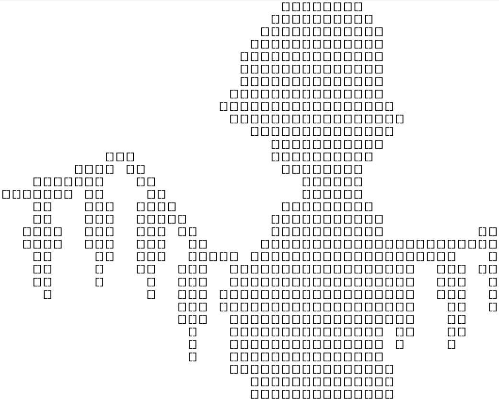
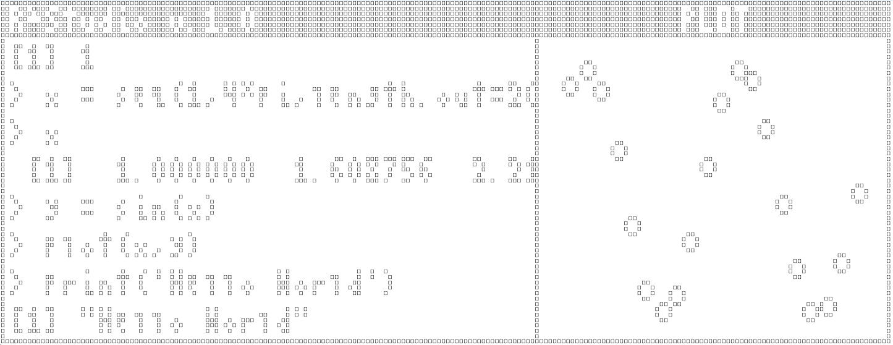

In-progress package for a game engine in vanilla RStudio.

The goal is to make it to CRAN!

[IMAGES OF THE PACKAGE FROM the rcade doc]

The package is fully documented and written up; see the [website](https://gbkorr.github.io/rcade/articles/rcade.html) for convenient navigation.
