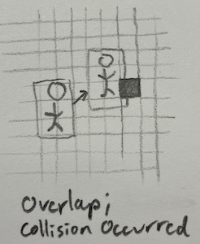

# Game: Super Rrio Platformer

    #> 
    #> [][][]  [][][]    []    [][]    [][][]
    #> [][]    []      [][][]  []  []  [][]
    #> []  []  [][][]  []  []  [][]    [][][]  v1.0.0
    #> 
    #> Open `vignette("guide")` to get started!
    #> Warning in fun(libname, pkgname): Please use RStudio! rcade may not work in
    #> other environments.

\[the rom\] a downside is that a game like this deserves its own
documentation (since it uses complex systems), which I don’t have reason
enough to make… but this rom at least shows that rcade is capable of
letting you do pretty much whatever you want in terms of gamedev if you
know how

\#turning around?

\#vertical scrolling where? a staircase is a great demo for this

## ???. Obstacles: the Collision

Before we can add more control to Rrio, we have to create ground for him
to interact with. I’d like to take the approach *Super Mario Bros.*
uses— if we store tiles of ground in a grid, it’s very easy to tweak and
edit, and makes drawing a lot simpler as well. We’ll call this grid of
tiles the *collision*.

### ??? Storing the Collision

We can encode our grid of tiles with a matrix, where 0s indicate empty
space and different numbers specify different tiles. For this game,
we’ll end up treating all tiles the same—as solid tiles that block
Rrio—but they’ll have different graphics depending on which tile they
are.

## ?? Tile Graphics (make sure these are accurate to the final)

Let’s make some sprites for the different tiles. I’ve already decided
that I want each tile to occupy 4x4 pixels on the screen.

\<\>\<\>\<\>\< \|\|\|\|\|

\\——-

### ??? Tile Stitching

To render the collision, we could draw each tile as its own sprite and
location, but this is needessly expensive. Instead, we can use the
collision matrix to fill in a single sprite corresponding to the
onscreen portion of collision, and draw that sprite in a static
location. Rather than make the *sprite* move its xy position, we let
math move the tiles inside the sprite every time we generate it.

\#image

**Code TODOTODO**

## ???. Collision Physics

Now for the main purpose of the collision: colliding. The collision is
there to block Rrio’s (and other enemies’) motion, and provide surfaces
for them to stand on.

We implement this by checking each frame if a given physics object (like
Rrio) has touched the collision, and resolving it if they did— by, for
example, stopping them flush with the tile they hit instead of letting
them phase through it. Objects experience ballistic freefall when they
aren’t touching any collision, as you’d expect in the real world.

I came up with this specific implementation of collision detection and
resolution by myself, but I suspect many games have converged on the
same implementation and I doubt the details are novel. There are
definitely better systems out there too[¹](#fn1), but this one works
well enough and is pretty satisfying!

### ???.1 Checking if a Collision has Happened

The first step is to see if the object has actually hit anything. To do
that, we see if the object’s *bounding box*—the invisible box around
them that we use to check collision—has overlapped any tiles of
collision this frame.

I usually make the bounding box roughly match the positiona and size of
the object’s sprite, but this doesn’t always have to be the case; giving
an object a smaller bounding box than its sprite suggests can make it
feel more lithe and mobile, and I set Rrio’s bounding box to have a
height of 1.8 tiles so he can fit through 2-tile gaps.

This is achieved in code by calculating the subset of tiles the bounding
box occupies (i.e. every tile the bounding box is present in), and
seeing if any of those tiles are solid.

**Code TODOTODO**

### ???.2 Checking Collision Direction

If a collision occurred, the next step is resolve it. We’d like to move
the object’s bounding box flush with the edge of the tile it
hit[²](#fn2), but to do that, we first need to know which edge that is.

Luckily, we don’t actually need to know anything about the tile to see
which edge was entered. We can do some \[\[\]\[\]\[\]\]\[ thinking:

- We already know a collision has occurred, so we must have hit at least
  one tile somewhere.

- We can only going to collide with tiles in the direction we’re moving.

- We can only collide with tiles if we pass a gridline, e.g our position
  goes from `2.5` to `3.2` (passing the `3` gridline).

This gives us enough to assert that if the leading edge (i.e. the one
going forwards) of our object’s bounding box passes a gridline, we’ve
collided with a block on that edge.

However, this reasoning only works in one dimension. So we do this
collision checking process twice: once vertically (landing on tiles),
then horizontally.

**Code TODOTODO**

### ??.3 Landing

The player expects to start falling if they walk off a cliff. We have to
add some code[³](#fn3) to make sure that happens.

Generally, this is done by pretending the player is falling every frame;
this causes them to immediately reland on whatever surface they were on.
And if they’ve walked off of something, they’ll just start falling.

I usually track falling status with a property called `grounded` for
objects with gravity; `grounded` is true if the object is sitting on a
surface. Then at the start of the collision function we set `grounded`
to false, and then reset it to true if the object lands on a flat
surface; since this is entirely contained in the function, the rest of
the game code will think the object has been grounded this whole time.

\#\[\[\]\]\] GIF or DRAWING of a guy falling off a cliff or ledge

------------------------------------------------------------------------

1.  Some of which I’ve used in previous games!

2.  This is our intuitive expectation; if I drop a book on the ground,
    it’s going to lay flush with the ground. Code is needed to make that
    happen.

3.  Present in the previous sections’ code.
