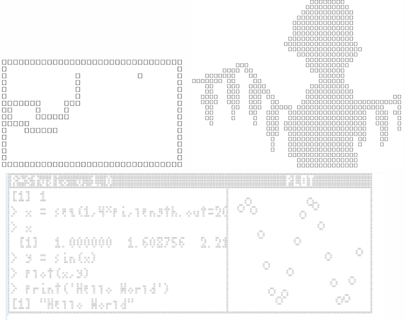

`rcade` is a fully documented R package with detailed articles on its
systems and their application. Some of my best writing is in the
articles for the [Snake
Devlog](https://gbkorr.github.io/rcade/articles/snake.html) and
[Rendering System](https://gbkorr.github.io/rcade/articles/render.html),
but I think all the articles are fun to read :)

    devtools::install_github("gbkorr/rcade")

The package lets you play and develop games in vanilla R, played right
on the console!  
Check out the
[website](https://gbkorr.github.io/rcade/articles/rcade.html) to learn
more about more about the package and browse the documentation.

