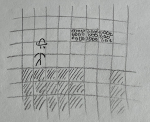
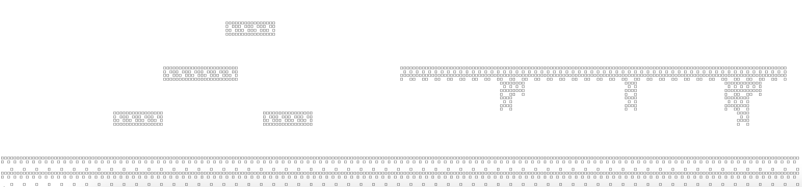
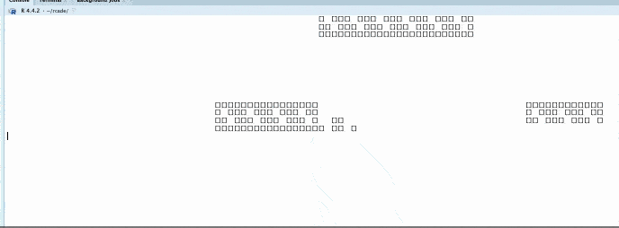

```{r, include = FALSE}
knitr::opts_chunk$set(
  collapse = TRUE,
  comment = "#>"
)
```

```{r setup, echo=F}
library(rcade)
```


intro

This article will be a bit looser than `vignette("snake")`--- rather than walking through every step of the code, it will instead cover the bigger-picture ideas of how the game operates and runs. Some code will be included, but a comprehensive amount; if you want a closer look at the code, just inspect the ROM itself: `View(SuperRrio)`.


## 1. The Plan
I want this game to be a decently similar experience to playing *Super Mario Bros.*. To do this, I'll want:

- A controllable character (Mario -> Rrio) that can run and jump.

- A scrolling screen that always keeps Rrio at the center, and obstacles to land on.

- Moving enemies that Rrio can jump on to defeat.

I don't feel like making a whole game--- one level should be a good enough proof of concept. (And will make it easy to add future levels!)

## 2. Initialization
Let's create the ROM with `rom.init`. For settings, we'll choose:

* 96x32 resolution: horizontal features will be much more important in this game, so we don't need much vertical space.[^1]

[^1]: And we'll code it so that the dimensions can be easily adjusted without impacting gameplay.

* 60fps framerate: for action games, we always want to be at 60fps for the smoothest experience.[^2]

[^2]: And even if the game struggles to draw at that speed, it'll run at least as well as 30fps! See `vignette("timing")`.

* Keybinds: `AD` to move left/right, `SPACE` to jump.

* We don't need to set sprites or game code yet, since we'll do that throughout the article.

<details>
  <summary>`rom.init()`</summary>
```{r}
SuperRrio = rom.init(
  screen.width = 96, screen.height = 32,
  framerate = 60,
  keybinds = c(a='left',d='right',' '='jump')
)
```
</details>

## 3. Controlling Rrio
Let's get started by drawing Rrio, the most important character in the game!

### 3.1 Pixel Art
Rrio will be animated and have a different animation depending on if he's running, jumping, falling, etc. For now, let's just start with a static sprite for standing.

<details>
  <summary>`SuperRrio$sprites$rrio.idle`</summary>
```{r}
SuperRrio$sprites$rrio.idle = render.makesprite('

   oo
 o oo o
 oooooo
   o o

  ooo
 o o o
   o
   o
  o o
  o o
')

#test it:
render.matrix(SuperRrio$sprites$rrio.idle)
```
</details>

### 3.2 *Drawing Rrio
Because of the scrolling screen, Rrio will always stay centered horizontally. This is pretty convenient for drawing him, but will lead to some challenges when we want to draw everything else.

To test, let's spawn him in the center of the screen to make sure everything is worki

<details>
  <summary>`initializing RAM$objects$rrio`</summary>
```{r}
SuperRrio$startup = function(RAM){
  RAM$objects$rrio = list(
    x = floor(RAM$ROM$screen.width/2), #centered horizontally
    y = floor(RAM$ROM$screen.height/2), #centered vertically
    
    spritename = 'rrio.idle'
  )  
  
  return(RAM)
}
```
</details>

BAD CODE DEMO, THIS ISNT A WALKTHROUGH---- ITS A RECORD OF THE SYSTEMS IN THIS GAME

Now when we run `quickload(SuperRrio)`, we see Rrio in the center of the screen.


control stuff has to be after collision


We'll be adding stuff to rrio's data in `startup` a lot throughout this guide.


the impulse inputs present a bit of a problem for smooth control. the solution ive chosen is to implement different behavior depending on what's pressed: A vs A+Jump vs when midair


## 4. Obstacles
Before we can add more control to Rrio, we have to create ground for him to interact with. I'd like to take the approach *Super Mario Bros.* uses--- if we store blocks of ground in a grid, it's very easy to tweak and edit, and makes drawing a lot simpler as well.



### 4.1 Collision Storage
We'll store this grid of ground tiles---which I'll refer to as "the collision"---in `RAM$objects$collision`. It'll just be a sprite-like matrix, but instead of encoding individual pixels, it'll encode which gridsquares are empty (0) or various kinds of tiles (1+). Because this matrix is sprite-like, we can make it with `render.makesprite()`! This is a huge boon for level creation, as it makes it even easier to create the collision for a level.

<details>
  <summary>**Defining the Collision in SuperRrio$startup()**</summary>
```{r eval=F}
RAM$objects$collision = list(
    data = render.makesprite('
    
                  bbbb    
          
    
             bbbbbb             rrrrrrrrrrrrrrrrrrrrrrrrrrrrrrr
                                        rr        r       rrr
                                        r         r       rr
         bbbb        bbbb                                 r


oooooooooooooooooooooooooooooooooooooooooooooooooooooooooooooooo
oooooooooooooooooooooooooooooooooooooooooooooooooooooooooooooooo                            
',lookup=c(' '=0,o=1,b=2,r=3))
)
```
</details>


### 4.2 Drawing Collision
Each tile will occupy 4x4 pixels. Thus, we'll want to make a 4x4 sprite for each kind of tile we want to be able to draw:

<details>
  <summary>**Tile Sprites**</summary>
```{r}
SuperRrio$tilesize = 4

SuperRrio$sprites$ground_tile = render.makesprite('
OOOO
O O

   O                                               
')
SuperRrio$sprites$brick_tile = render.makesprite('
OOOO
O OO
OO O
OOOO                                                  
')
SuperRrio$sprites$rock_tile = render.makesprite('
OOOO
 O O
OOOO
O  O
')
```
</details>

Now to draw the collision, we can just stick all the tile sprites together according to the collision matrix. The code for this is pretty dense, but what it does is rather simple.

<details>
  <summary>**Stitching Tiles into a Sprite**</summary>
```{r}
SuperRrio$assemble_collision_sprite = function(RAM){
  M = RAM$objects$collision$data #collision matrix
  
  ts = RAM$ROM$tilesize #= 4
  #tilesize; this makes it easier to upgrade the graphics later if we wanted
  
  sprite = matrix(0,nrow=ts*nrow(M),ncol=ts*ncol(M)) #the sprite will be 4x the size, since each tile is 4x4 pixels
  
  for (y in 1:nrow(M)) for (x in 1:ncol(M)){
    tile = M[y,x]
  
    if (tile != 0){ #nonempty sprite
      sprite[ts*y + (1 - 1:(ts)), ts*x + (1 - 1:(ts))] = RAM$ROM$sprites[[ #lookup sprite corresponding to tile and paste it in
        c(
          'ground_tile',
          'brick_tile',
          'rock_tile'
        )[tile] 
      ]][ts:1,ts:1] #mirror twice because reasons
    }
    
  }
  
  return(sprite)
}
```
</details>


And if we test this with `render.matrix()` on the collision,

<details>
  <summary>**IMAGE**</summary>

</details>

Success! Although I had to zoom out (`cmd -`) fully to get it to render properly.


But we don't actually want to do it this way. The whole level doesn't fit onscreen at once, so *most tiles will be offscreen most of the time*. We can take advantage of this by *culling* and only looking at onscreen tiles to stitch.

Luckily, this is as simple as subsetting the collision matrix:

```{r eval=F}
SuperRrio$assemble_collision_sprite = function(RAM, xrange, yrange){
  M = RAM$objects$collision$data #collision matrix
  M = M[yrange,xrange]
  ...
  #(some extra code to clip and pad this matrix is needed too)
```

Next we'll figure out how to determine which tiles are actually onscreen so we know how to set the xrange and yrange.
  
## 5. Screen Scrolling
In order to scroll the screen, we'll have to keep track of Rrio's position. Because `RAM$objects$rrio$x` and `$y` are used to determine where to draw Rrio on the screen (and we're keeping him fixed in the center for now), we'll have to make new variables to track Rrio's position in the stage.

We'll define this as `RAM$objects$rrio$pos.x` and `$pos.y`. It's most convenient if we scale these so one unit of `pos.x` corresponds to one unit on the collision matrix, or 4 pixels onscreen.

Then we can do a bit of math with this to get the section of collision we want.

NEED TO EXPLAIN THE NUDGING

<details>
  <summary>**Scrolling Code (X only)**</summary>
```{r eval=F}
#in ROM$startup(), when initializing collision
RAM$objects$collision$draw = function(scene, obj, RAM){
  pos.x = RAM$objects$rrio$pos.x
  screen_width_converted = ceiling(RAM$ROM$screen.width / RAM$ROM$tilesize) #screen width in units of collision matrix
  
  #range of columns in the collision matrix that should be onscreen
  xrange = (1:screen_width_converted) + floor(pos.x)
  
  #extra nudge for the sprite to scroll smoothly by pixel
  remainder.x = remainder.x = floor(RAM$ROM$tilesize * (pos.x - floor(pos.x)))
  
  sprite = RAM$ROM$assemble_collision_sprite(RAM,xrange,5:12) #manually defining the Y range here since we haven't set that up yet
  scene = render.sprite(scene, sprite, x=-remainder.x, y=1, layer=2)
  return(scene)
}
```
</details>

Et voilà--- if we move Rrio (I've set his `$pos.x` to increase by a little every frame), the collision scrolls smoothly past.

<details>
  <summary>**IMAGE**</summary>

</details>

Unfortunately, we can see the characteristic flickering rcade gets at higher resolutions: it's a limitation of `cat()` and can't be helped.[^3]

RUNNING AT 30FPS ACTUALLY DOES MAKE IT LOOK NICER

[^3]: If RStudio respected more ANSI escape codes, we could pull something like `\033[1F` to *overwrite* the previous frame (similar to how you can overwrite a single line with `\r`) instead of having to wipe and redraw it, but we're already lucky enough that `\f` works in the first place.

# remember to do this
I'm gonna do something similar for Y, but only update it when Rrio lands. More on that later.


## 6. Collision and Gravity

Now to let Rrio interact with the collision. First, we'll give him some physics:

<details>
  <summary>**Basic Movement**</summary>
```{r eval=F}
#in RAM$startup:
{
  RAM$objects$rrio = list(
    x = floor(RAM$ROM$screen.width/2), #centered horizontally
    y = floor(RAM$ROM$screen.height/2), #centered vertically
    
    pos.x = 1,
    pos.y = 1,
    
    #velocity
    vx = 0,
    vy = 0,
    
    #gravity
    gravity = 9.8/60, #corresponds to earth gravity for 1 unit = 1 meter at 60fps
    
    spritename = 'rrio.idle'
  )  
}

SuperRrio$move_rrio = function(RAM){
	rrio = RAM$objects$rrio
	
	#code controlling rrio will be in a function called before this one

	#apply gravity
	RAM$objects$rrio$vy = rrio$vy - rrio$gravity

	#code for interacting with collision

	#code to move Rrio
	RAM$objects$rrio$pos.x = rrio$pos.x + rrio$vx
	RAM$objects$rrio$pos.y = rrio$pos.y + rrio$vy

	return(RAM)
}
```
</details>

Now I'm going 


ive reduced the screen width a bit temporarily to make it easier to see when testing


